# 项目架构总览

## 项目概述

日语AI视频生成平台是一个为日本用户设计的AI视频生成服务，通过智能翻译技术解决VEO3模型不支持日语的问题。

## 技术架构

### 整体架构图

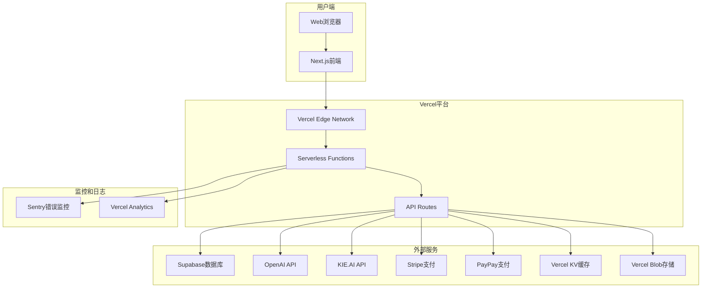

### 技术栈详解

#### 前端技术栈
- **Framework**: Next.js 14 (App Router)
- **Language**: TypeScript
- **Styling**: Tailwind CSS
- **Animation**: Framer Motion
- **State Management**: SWR
- **Form Handling**: React Hook Form + Zod
- **Testing**: Jest + Testing Library + Playwright

#### 后端技术栈
- **Runtime**: Vercel Serverless Functions
- **Database**: Supabase (PostgreSQL)
- **Authentication**: JWT + Supabase Auth
- **Caching**: Vercel KV (Redis)
- **File Storage**: Vercel Blob
- **Payment**: Stripe + PayPay
- **Monitoring**: Sentry + Vercel Analytics

#### 外部API集成
- **AI翻译**: OpenAI GPT-4
- **视频生成**: KIE.AI VEO3
- **支付处理**: Stripe + PayPay
- **邮件服务**: SendGrid (可选)

## 核心功能架构

### 1. 智能翻译系统

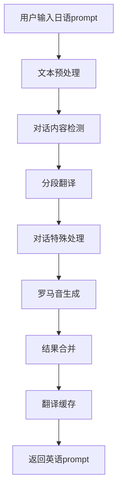

**核心组件：**
- **文本分析器**: 识别日语文本中的对话内容
- **翻译引擎**: 使用OpenAI GPT-4进行高质量翻译
- **罗马音转换**: 为日语对话生成准确的罗马音
- **缓存系统**: 缓存翻译结果提高性能

### 2. 视频生成系统

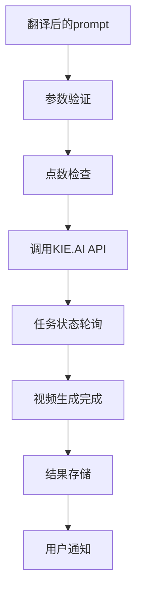

**核心组件：**
- **任务管理器**: 管理视频生成任务状态
- **状态轮询**: 定期检查生成进度
- **结果处理**: 处理生成的视频文件
- **通知系统**: 生成完成后通知用户

### 3. 用户管理系统

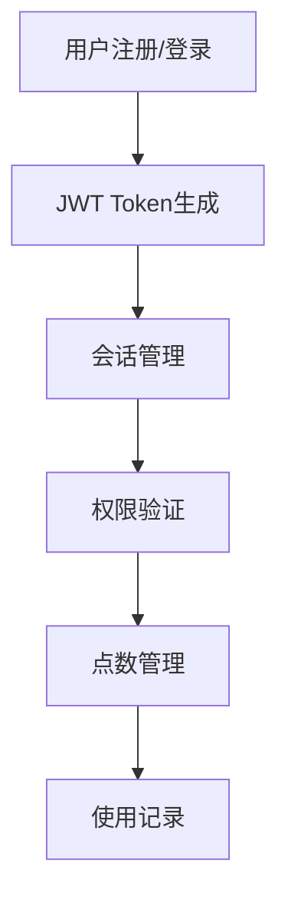

**核心组件：**
- **认证系统**: JWT token + Supabase Auth
- **会话管理**: 用户会话状态管理
- **权限控制**: 基于角色的访问控制
- **点数系统**: 用户点数余额管理

### 4. 支付系统

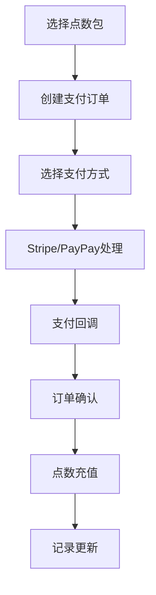

**核心组件：**
- **订单系统**: 支付订单生成和管理
- **支付网关**: Stripe和PayPay集成
- **回调处理**: 支付结果处理
- **点数充值**: 自动点数充值系统

## 数据架构

### 数据库设计

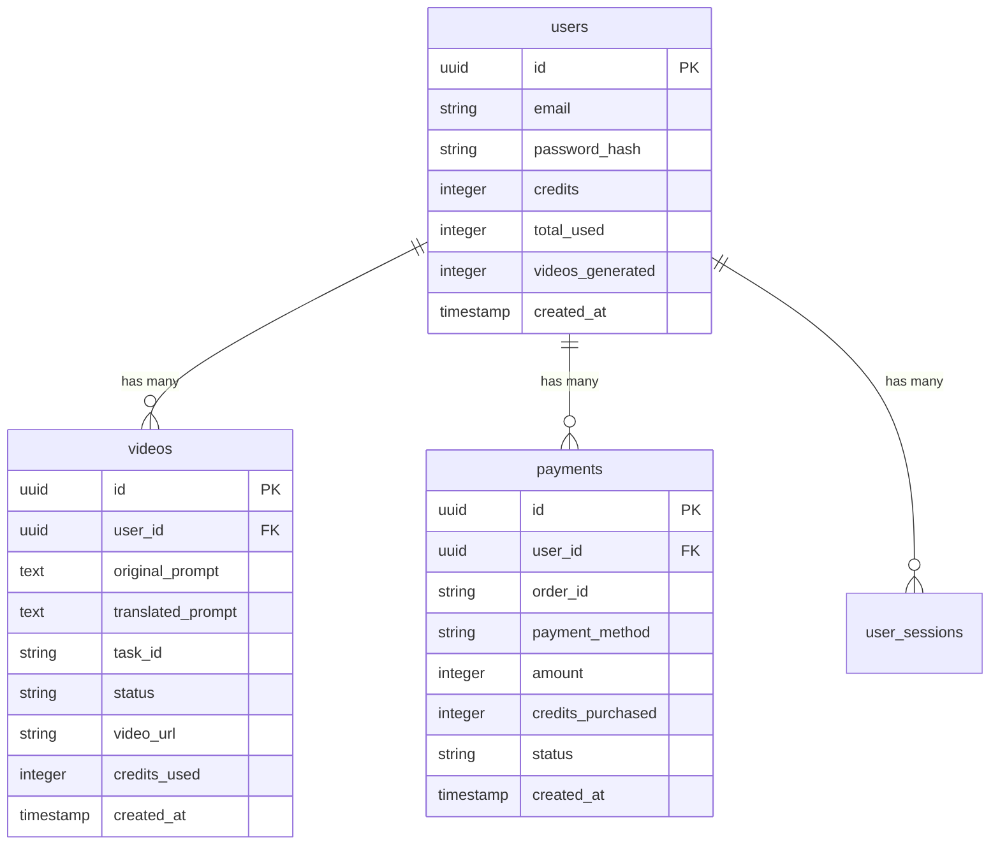

### 缓存策略

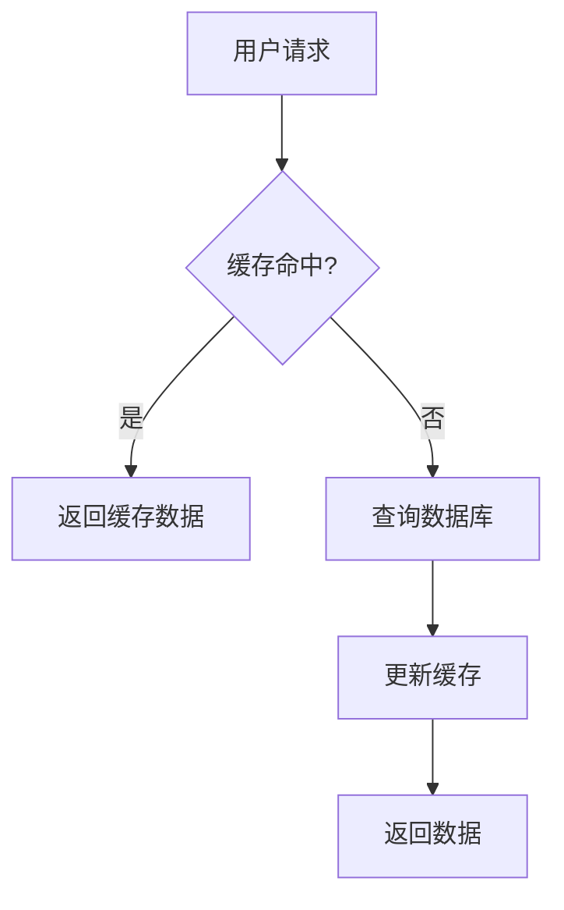

**缓存层级：**
- **L1**: 浏览器缓存 (静态资源)
- **L2**: CDN缓存 (Vercel Edge Network)
- **L3**: 应用缓存 (Vercel KV)
- **L4**: 数据库缓存 (Supabase内置)

## 部署架构

### Vercel部署架构

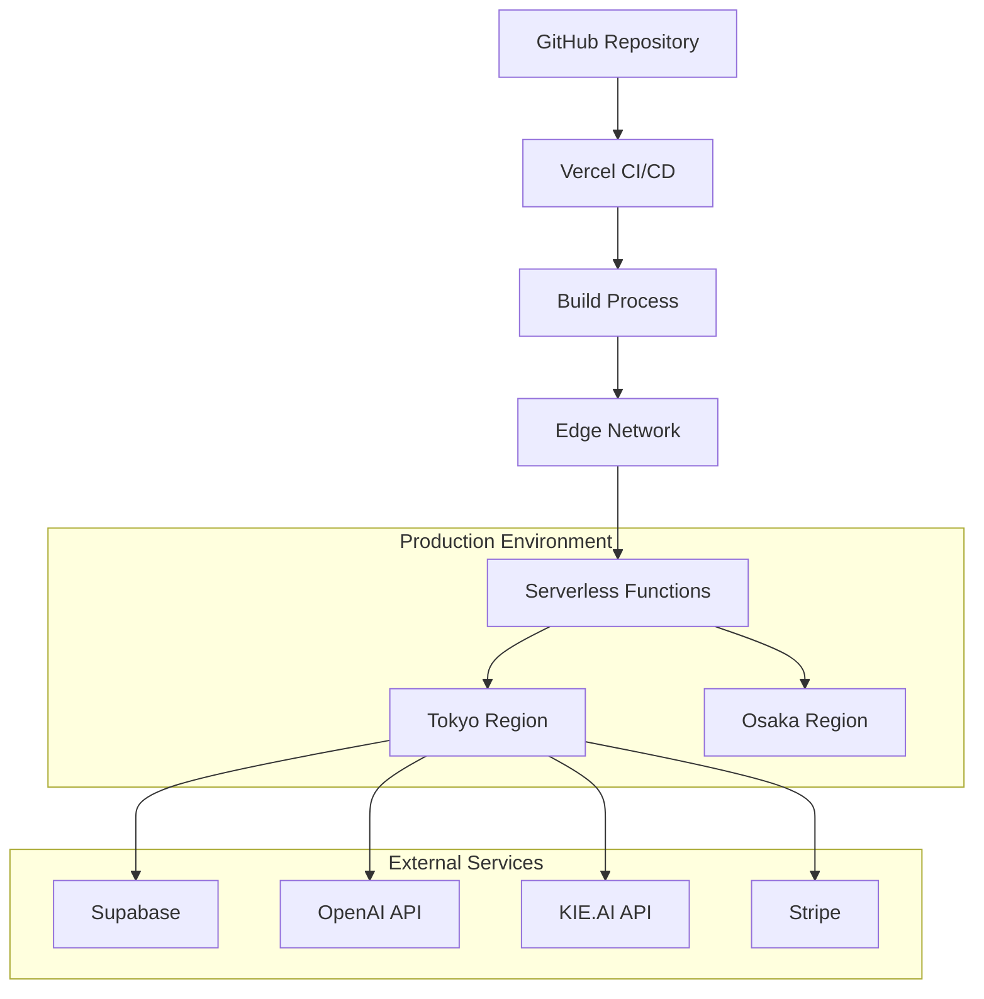

**部署特点：**
- **自动部署**: Git push触发自动部署
- **全球CDN**: 静态资源全球分发
- **边缘计算**: 函数在用户附近执行
- **A/B测试**: 支持流量分割测试

### 环境管理

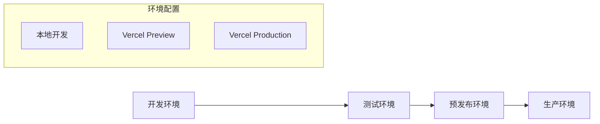

**环境特点：**
- **开发环境**: 本地开发，热重载
- **预览环境**: 每个PR自动创建预览
- **生产环境**: 主分支自动部署

## 性能优化

### 前端性能

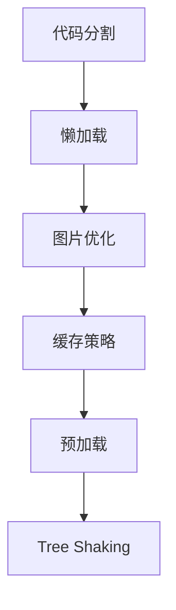

**优化策略：**
- **代码分割**: 按路由和组件分割代码
- **图片优化**: Next.js Image组件自动优化
- **缓存策略**: 静态资源长期缓存
- **预加载**: 关键资源预加载

### 后端性能

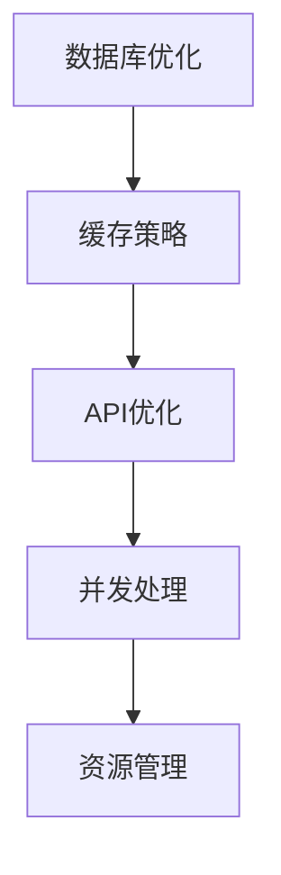

**优化策略：**
- **数据库优化**: 索引优化、查询优化
- **缓存策略**: 多级缓存、智能失效
- **API优化**: 响应压缩、批量处理
- **并发处理**: 异步处理、队列管理

## 安全架构

### 安全措施

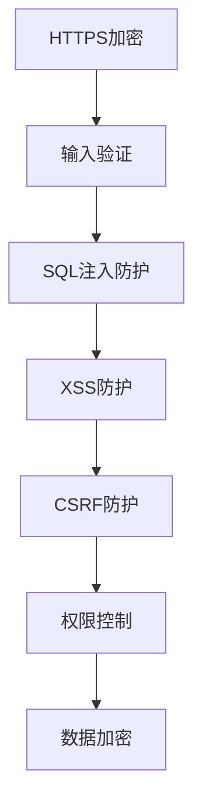

**安全特点：**
- **传输安全**: HTTPS、TLS 1.3
- **数据安全**: 敏感数据加密存储
- **访问控制**: JWT token + 角色权限
- **输入验证**: 严格的输入验证和过滤

### 监控和日志

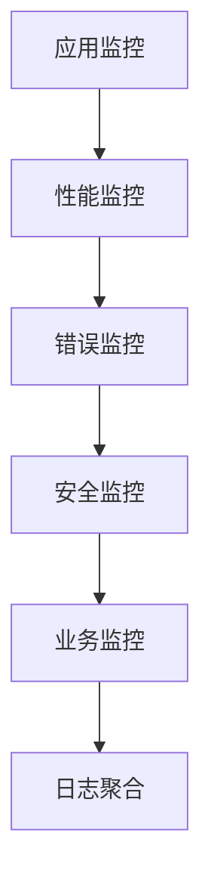

**监控体系：**
- **错误监控**: Sentry实时错误追踪
- **性能监控**: Vercel Analytics性能分析
- **业务监控**: 自定义业务指标
- **日志管理**: 结构化日志收集

## 扩展性设计

### 水平扩展

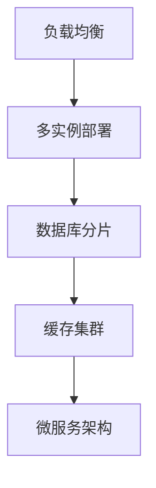

**扩展策略：**
- **无状态设计**: 函数无状态，易于扩展
- **数据库扩展**: 读写分离、分库分表
- **缓存扩展**: 分布式缓存
- **服务拆分**: 微服务架构

### 可用性设计

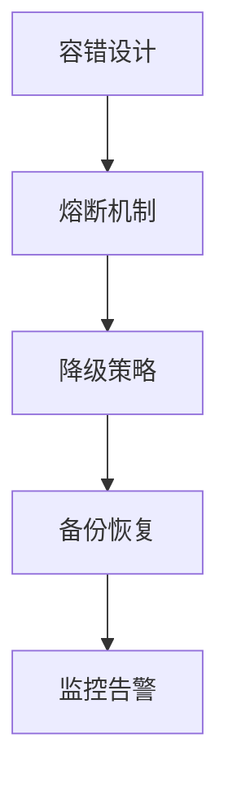

**可用性保证：**
- **故障隔离**: 服务间故障隔离
- **自动恢复**: 自动故障恢复
- **备份策略**: 定期数据备份
- **监控告警**: 实时监控和告警

## 开发工作流

### CI/CD流程

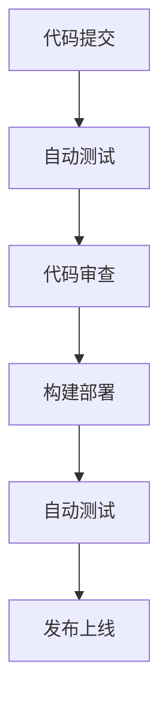

**开发流程：**
1. **本地开发**: 功能开发和测试
2. **代码提交**: Git提交和推送
3. **自动化测试**: 单元测试、集成测试
4. **代码审查**: Pull Request审查
5. **自动部署**: 自动构建和部署
6. **生产发布**: 生产环境发布

### 质量保证

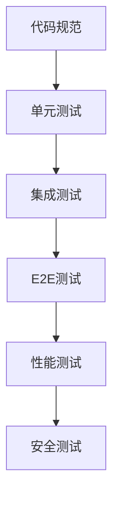

**质量措施：**
- **代码规范**: ESLint + Prettier
- **类型检查**: TypeScript严格模式
- **测试覆盖**: 80%以上代码覆盖率
- **性能测试**: 响应时间监控
- **安全测试**: 安全漏洞扫描

## 运维监控

### 监控体系

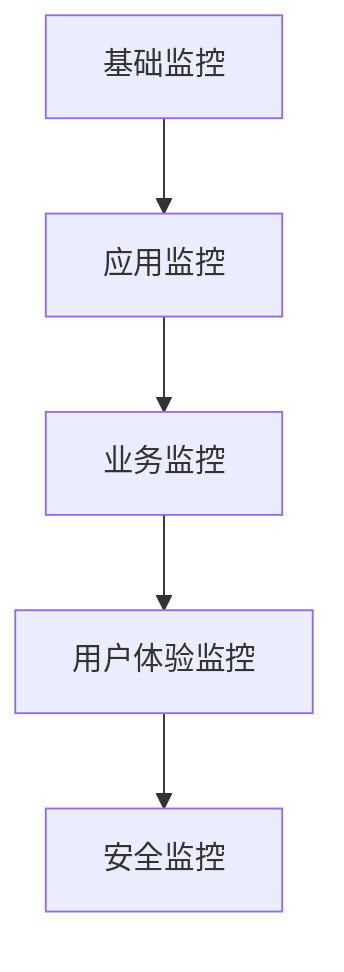

**监控指标：**
- **系统指标**: CPU、内存、网络
- **应用指标**: 响应时间、错误率
- **业务指标**: 用户活跃度、转化率
- **安全指标**: 异常访问、攻击检测

### 日志管理

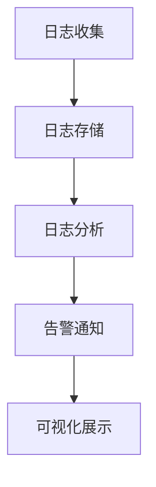

**日志特点：**
- **结构化日志**: JSON格式日志
- **实时收集**: 实时日志收集
- **智能分析**: 异常日志识别
- **可视化**: 日志可视化展示

这个架构设计确保了系统的可扩展性、高可用性和优秀的用户体验，为日语AI视频生成平台提供了坚实的技术基础。 