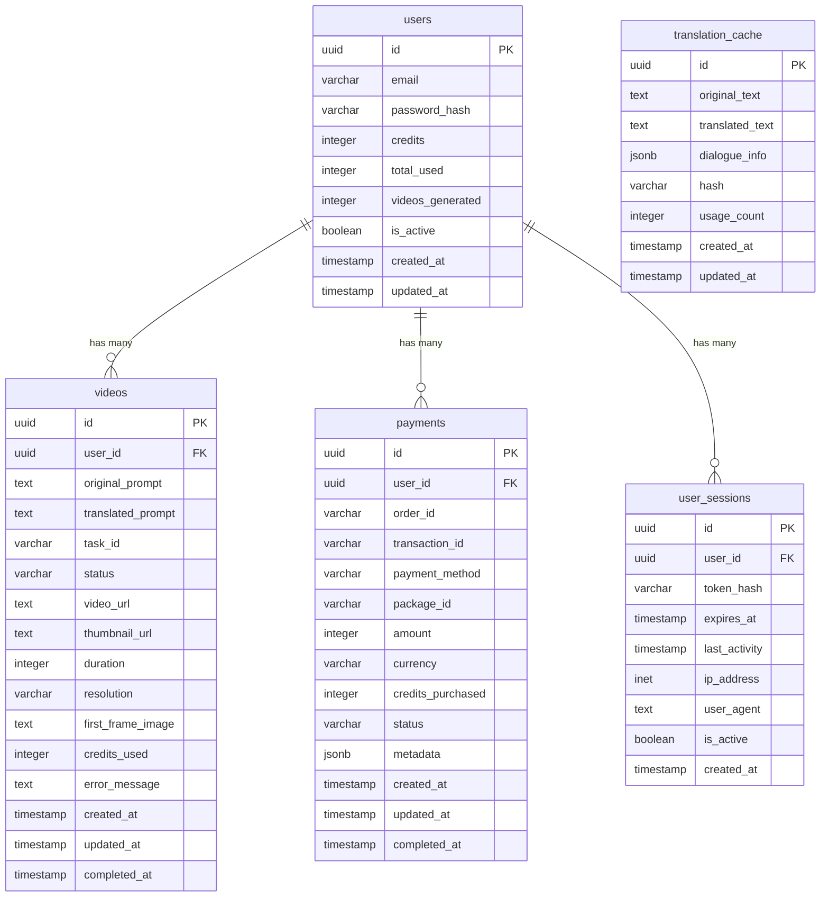

# 数据库架构文档

## 概述

本项目使用Supabase（PostgreSQL）作为主数据库，包含用户管理、视频生成记录、支付记录等核心功能模块。

## 表结构

### 1. users（用户表）

存储用户基本信息和点数余额。

```sql
CREATE TABLE users (
    id UUID PRIMARY KEY DEFAULT gen_random_uuid(),
    email VARCHAR(255) UNIQUE NOT NULL,
    password_hash VARCHAR(255) NOT NULL,
    credits INTEGER DEFAULT 100 NOT NULL,
    total_used INTEGER DEFAULT 0 NOT NULL,
    videos_generated INTEGER DEFAULT 0 NOT NULL,
    is_active BOOLEAN DEFAULT true NOT NULL,
    created_at TIMESTAMP WITH TIME ZONE DEFAULT NOW(),
    updated_at TIMESTAMP WITH TIME ZONE DEFAULT NOW()
);

-- 索引
CREATE INDEX idx_users_email ON users(email);
CREATE INDEX idx_users_created_at ON users(created_at);
```

**字段说明：**
- `id`: 用户唯一标识符
- `email`: 用户邮箱（登录凭证）
- `password_hash`: 密码哈希值
- `credits`: 当前点数余额
- `total_used`: 累计使用点数
- `videos_generated`: 生成视频数量
- `is_active`: 账户状态

### 2. videos（视频生成记录表）

存储所有视频生成请求和结果。

```sql
CREATE TABLE videos (
    id UUID PRIMARY KEY DEFAULT gen_random_uuid(),
    user_id UUID NOT NULL REFERENCES users(id) ON DELETE CASCADE,
    original_prompt TEXT NOT NULL,
    translated_prompt TEXT NOT NULL,
    task_id VARCHAR(255) UNIQUE NOT NULL,
    status VARCHAR(50) DEFAULT 'pending' NOT NULL,
    video_url TEXT,
    thumbnail_url TEXT,
    duration INTEGER, -- 视频时长（秒）
    resolution VARCHAR(20), -- 分辨率：768P, 1080P
    first_frame_image TEXT, -- 首帧图片URL
    credits_used INTEGER NOT NULL,
    error_message TEXT,
    created_at TIMESTAMP WITH TIME ZONE DEFAULT NOW(),
    updated_at TIMESTAMP WITH TIME ZONE DEFAULT NOW(),
    completed_at TIMESTAMP WITH TIME ZONE
);

-- 索引
CREATE INDEX idx_videos_user_id ON videos(user_id);
CREATE INDEX idx_videos_task_id ON videos(task_id);
CREATE INDEX idx_videos_status ON videos(status);
CREATE INDEX idx_videos_created_at ON videos(created_at);
```

**字段说明：**
- `id`: 视频记录唯一标识符
- `user_id`: 关联用户ID
- `original_prompt`: 原始日语prompt
- `translated_prompt`: 翻译后的英语prompt
- `task_id`: kie.ai任务ID
- `status`: 状态（pending, processing, completed, failed, cancelled）
- `video_url`: 生成的视频URL
- `thumbnail_url`: 缩略图URL
- `duration`: 视频时长
- `resolution`: 分辨率
- `first_frame_image`: 首帧图片（可选）
- `credits_used`: 消耗的点数
- `error_message`: 错误信息（如果失败）

### 3. payments（支付记录表）

存储所有支付交易记录。

```sql
CREATE TABLE payments (
    id UUID PRIMARY KEY DEFAULT gen_random_uuid(),
    user_id UUID NOT NULL REFERENCES users(id) ON DELETE CASCADE,
    order_id VARCHAR(255) UNIQUE NOT NULL,
    transaction_id VARCHAR(255),
    payment_method VARCHAR(50) NOT NULL, -- stripe, paypay
    package_id VARCHAR(50) NOT NULL,
    amount INTEGER NOT NULL, -- 金额（日元分）
    currency VARCHAR(3) DEFAULT 'JPY' NOT NULL,
    credits_purchased INTEGER NOT NULL,
    status VARCHAR(50) DEFAULT 'pending' NOT NULL,
    metadata JSONB,
    created_at TIMESTAMP WITH TIME ZONE DEFAULT NOW(),
    updated_at TIMESTAMP WITH TIME ZONE DEFAULT NOW(),
    completed_at TIMESTAMP WITH TIME ZONE
);

-- 索引
CREATE INDEX idx_payments_user_id ON payments(user_id);
CREATE INDEX idx_payments_order_id ON payments(order_id);
CREATE INDEX idx_payments_status ON payments(status);
CREATE INDEX idx_payments_created_at ON payments(created_at);
```

**字段说明：**
- `id`: 支付记录唯一标识符
- `user_id`: 关联用户ID
- `order_id`: 订单ID
- `transaction_id`: 第三方支付平台交易ID
- `payment_method`: 支付方式
- `package_id`: 点数包ID
- `amount`: 支付金额（日元分）
- `currency`: 货币类型
- `credits_purchased`: 购买的点数
- `status`: 支付状态（pending, completed, failed, cancelled, refunded）
- `metadata`: 额外信息（JSON格式）

### 4. translation_cache（翻译缓存表）

缓存翻译结果以提高性能。

```sql
CREATE TABLE translation_cache (
    id UUID PRIMARY KEY DEFAULT gen_random_uuid(),
    original_text TEXT NOT NULL,
    translated_text TEXT NOT NULL,
    dialogue_info JSONB,
    hash VARCHAR(64) UNIQUE NOT NULL,
    usage_count INTEGER DEFAULT 1 NOT NULL,
    created_at TIMESTAMP WITH TIME ZONE DEFAULT NOW(),
    updated_at TIMESTAMP WITH TIME ZONE DEFAULT NOW()
);

-- 索引
CREATE INDEX idx_translation_cache_hash ON translation_cache(hash);
CREATE INDEX idx_translation_cache_usage_count ON translation_cache(usage_count);
```

**字段说明：**
- `id`: 缓存记录唯一标识符
- `original_text`: 原始文本
- `translated_text`: 翻译结果
- `dialogue_info`: 对话信息（JSON格式）
- `hash`: 原始文本的哈希值
- `usage_count`: 使用次数
- `created_at`: 创建时间
- `updated_at`: 更新时间

### 5. user_sessions（用户会话表）

存储用户登录会话信息。

```sql
CREATE TABLE user_sessions (
    id UUID PRIMARY KEY DEFAULT gen_random_uuid(),
    user_id UUID NOT NULL REFERENCES users(id) ON DELETE CASCADE,
    token_hash VARCHAR(255) NOT NULL,
    expires_at TIMESTAMP WITH TIME ZONE NOT NULL,
    last_activity TIMESTAMP WITH TIME ZONE DEFAULT NOW(),
    ip_address INET,
    user_agent TEXT,
    is_active BOOLEAN DEFAULT true NOT NULL,
    created_at TIMESTAMP WITH TIME ZONE DEFAULT NOW()
);

-- 索引
CREATE INDEX idx_user_sessions_user_id ON user_sessions(user_id);
CREATE INDEX idx_user_sessions_token_hash ON user_sessions(token_hash);
CREATE INDEX idx_user_sessions_expires_at ON user_sessions(expires_at);
```

**字段说明：**
- `id`: 会话唯一标识符
- `user_id`: 关联用户ID
- `token_hash`: JWT token哈希值
- `expires_at`: 过期时间
- `last_activity`: 最后活动时间
- `ip_address`: IP地址
- `user_agent`: 用户代理
- `is_active`: 会话状态

## 数据库关系图



## 触发器和函数

### 1. 更新用户统计信息

```sql
-- 更新用户视频生成统计
CREATE OR REPLACE FUNCTION update_user_video_stats()
RETURNS TRIGGER AS $$
BEGIN
    IF TG_OP = 'INSERT' THEN
        -- 新增视频记录时更新用户统计
        UPDATE users 
        SET videos_generated = videos_generated + 1,
            total_used = total_used + NEW.credits_used,
            credits = credits - NEW.credits_used
        WHERE id = NEW.user_id;
        
        RETURN NEW;
    END IF;
    
    RETURN NULL;
END;
$$ LANGUAGE plpgsql;

-- 创建触发器
CREATE TRIGGER trigger_update_user_video_stats
    AFTER INSERT ON videos
    FOR EACH ROW
    EXECUTE FUNCTION update_user_video_stats();
```

### 2. 支付完成后更新用户点数

```sql
-- 支付完成后更新用户点数
CREATE OR REPLACE FUNCTION update_user_credits_on_payment()
RETURNS TRIGGER AS $$
BEGIN
    IF NEW.status = 'completed' AND OLD.status != 'completed' THEN
        -- 支付完成时增加用户点数
        UPDATE users 
        SET credits = credits + NEW.credits_purchased
        WHERE id = NEW.user_id;
    END IF;
    
    RETURN NEW;
END;
$$ LANGUAGE plpgsql;

-- 创建触发器
CREATE TRIGGER trigger_update_user_credits_on_payment
    AFTER UPDATE ON payments
    FOR EACH ROW
    EXECUTE FUNCTION update_user_credits_on_payment();
```

### 3. 自动清理过期会话

```sql
-- 清理过期会话
CREATE OR REPLACE FUNCTION cleanup_expired_sessions()
RETURNS void AS $$
BEGIN
    DELETE FROM user_sessions 
    WHERE expires_at < NOW() OR is_active = false;
END;
$$ LANGUAGE plpgsql;

-- 创建定时任务（需要pg_cron扩展）
-- SELECT cron.schedule('cleanup-sessions', '0 * * * *', 'SELECT cleanup_expired_sessions();');
```

## 初始化数据

### 1. 创建默认点数包

```sql
-- 注意：这里使用应用级别的配置，不存储在数据库中
-- 在应用代码中定义默认点数包配置
```

### 2. 创建管理员用户

```sql
-- 创建管理员用户（密码需要在应用中哈希）
INSERT INTO users (email, password_hash, credits, is_active)
VALUES ('admin@example.com', 'hashed_password_here', 10000, true);
```

## 数据库迁移

### 1. 初始化脚本

```sql
-- 001_initial_schema.sql
-- 创建所有表结构和索引
-- 创建触发器和函数
-- 插入初始数据
```

### 2. 迁移脚本示例

```sql
-- 002_add_video_metadata.sql
ALTER TABLE videos ADD COLUMN metadata JSONB;
CREATE INDEX idx_videos_metadata ON videos USING GIN(metadata);
```

## 性能优化

### 1. 索引策略
- 主键自动创建唯一索引
- 外键字段创建索引
- 经常查询的字段创建索引
- 复合索引用于复杂查询

### 2. 分区策略
对于大数据量表，考虑按时间分区：

```sql
-- 按月分区videos表
CREATE TABLE videos_y2024m01 PARTITION OF videos
FOR VALUES FROM ('2024-01-01') TO ('2024-02-01');
```

### 3. 缓存策略
- 使用Redis缓存频繁查询的数据
- 翻译结果缓存到数据库
- 用户会话信息缓存

## 备份和恢复

### 1. 定期备份
```bash
# 每日备份
pg_dump -h localhost -U postgres -d video_generator > backup_$(date +%Y%m%d).sql

# 压缩备份
pg_dump -h localhost -U postgres -d video_generator | gzip > backup_$(date +%Y%m%d).sql.gz
```

### 2. 恢复数据
```bash
# 从备份恢复
psql -h localhost -U postgres -d video_generator < backup_20240101.sql

# 从压缩备份恢复
gunzip -c backup_20240101.sql.gz | psql -h localhost -U postgres -d video_generator
```

## 监控和维护

### 1. 性能监控
- 监控慢查询
- 监控索引使用情况
- 监控数据库连接数

### 2. 数据清理
- 定期清理过期会话
- 清理失败的视频记录
- 清理过期的翻译缓存

### 3. 统计信息更新
```sql
-- 更新统计信息
ANALYZE;

-- 重建索引
REINDEX DATABASE video_generator;
```

## 安全考虑

### 1. 权限管理
- 最小权限原则
- 应用用户只能访问需要的表
- 敏感操作需要特殊权限

### 2. 数据加密
- 密码使用bcrypt哈希
- 敏感数据考虑字段级加密
- 传输过程使用TLS

### 3. 审计日志
- 记录重要操作日志
- 监控异常访问模式
- 定期审查访问权限 